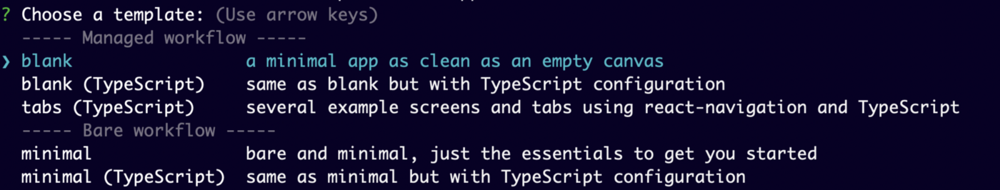
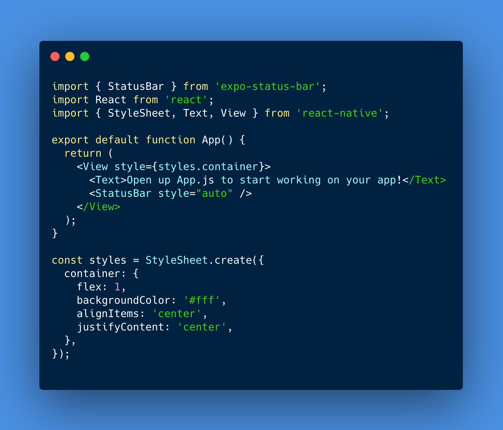
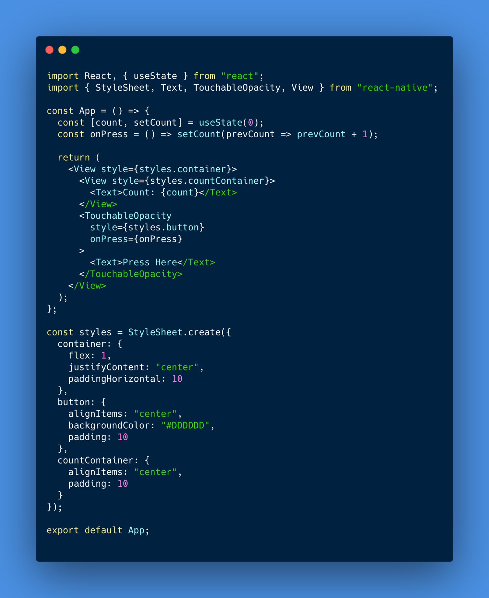
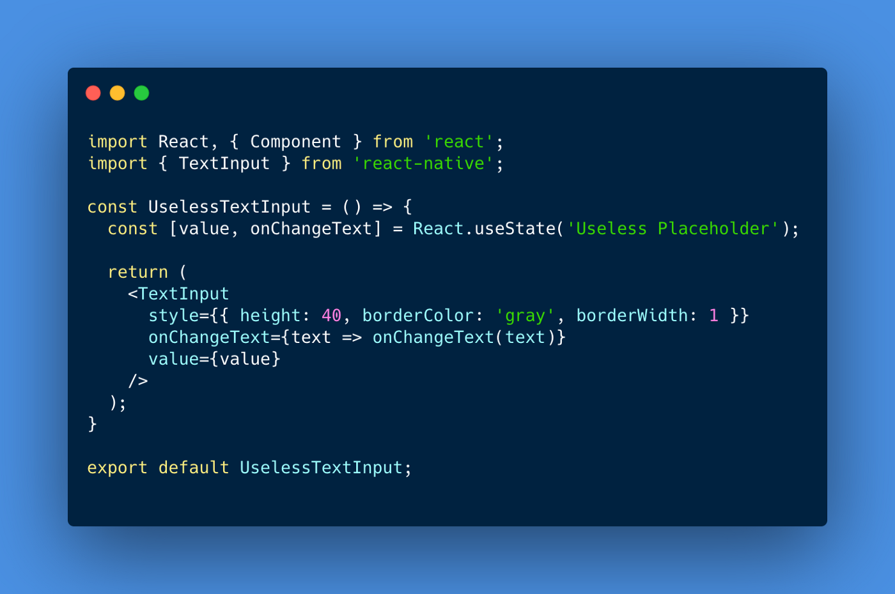
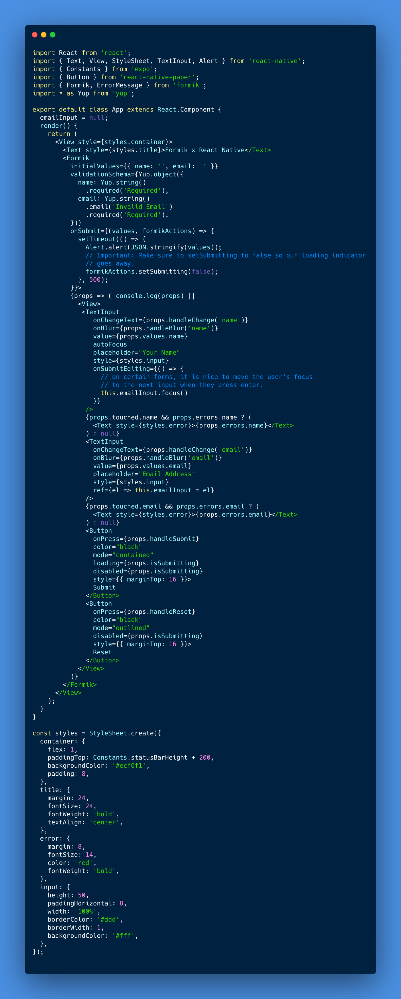

## Background
Before I begin, here’s a short introduction about myself. I’m a full stack developer and software engineer. I specialize in web, mobile and API development using primarily React, React Native and Node. In addition, I focus on cloud DevOps. If you’d like to learn more about me or work with me, you can visit my agency site [Aegis Studio](https://aegis.studio/) or my Twitter [@cbandara1010](https://twitter.com/cbandara1010)

## React Native & Expo CLI
React Native was created by Facebook to serve as a mobile application framework but thanks to the popularization of PWA’s (Progressive Web Apps), React Native has grown to become a multi-platform framework that supports mobile, web and desktop. Many developers prefer to work with bare bones React Native CLI but Expo CLI has been gaining popularity due to their consistent stable releases and feature updates from their paid staff.
One reason I love Expo CLI is that there’s no need to deal with pesky .gradle or pod files, Expo does all the hard work for you. Expo does this by simplifying the development process with their own components and plugins. It’s also easier to test applications on physical devices on your network with Expo. You just download the Expo App on your phone and scan a QR code. If you feel the need to go back to the barebones React Native CLI because Expo doesn’t support a specific feature your app needs, you can always eject Expo and go back to the barebones CLI without losing your work. When using a managed workflow in Expo, you get a lot of features right out of the box like user permissions and app signing. To see a full list of features provided by the Expo API check out this [reference documentation](https://docs.expo.io/versions/latest/).

## Getting Started with Expo
### Prerequisites
For this tutorial, I’m going to assume you have some experience using React previously. You will need a version of Node.js installed. If it’s not already on your machine, you can download it [here](https://nodejs.org/en/). You can get started with React [here](https://reactjs.org/docs/getting-started.html). React Native will also be used but Expo installs it all for us. If you check the [React Native Docs](https://reactnative.dev/docs/environment-setup), they actually recommend using Expo for the initial setup of your application.
### Installation
```
npm install expo-cli --global
```
Once this has finished we can get started creating our first Expo app.
```
expo init NewApp
```
You’ll be asked to pick from a managed or barebones workflow. For the purpose of this tutorial we’re going to go with a blank managed workflow.



If you prefer to use npm over yarn run: (This part is optional)
```
expo init NewApp --npm
```
next do
```
cd NewApp
yarn start
```


From the Expo dashboard, you can run iOS simulator or Android simulator. To do either of these you must have xCode and Android Studio installed on your machine. If you don’t have any of these, don’t worry you can download the Expo app on your iPhone or Android from the App Store and then use the QR code supplied by Expo. The best part about this is that updates happen quickly and there’s no need to rebuild your project in xCode every time you want to test on a physical device.

## Your First Application
Since this is a beginner tutorial, I’ll run through some of the basics of Expo and how to build on from there. If you’re having any problems running the iOS or android simulators, first make sure you are on the latest update of Android Studio and xCode. This will usually solve the problem.
Let’s open up our application in VS code and see what we have.



### Components
On line 3 you can see that Expo automatically imports 3 components from React Native for us. You’ll be using these 3 components very often which is why they’re there. Here’s the [React Native Docs](https://reactnative.dev/docs/components-and-apis) on core components. You’ll want to study up on this a lot further and be comfortable with knowing which component to use when. For example, there are certain scenarios where feedback should not be required when a user interacts with a component. This would be an excellent use for TouchableWithoutFeedback. Try loading an image by importing the Image component and then rendering it above our Text component
```
<Image source={require('@expo/snack-static/react-native-logo.png')}/>
```
While we’re covering components, one very important component is SafeAreaView. You should wrap your View components in this component when you want to make sure everything will be visible on the screen and not cut off by things such as the camera notch on iPhones.

### Styling
To add style to a component we can do it two ways mainly. We can do inline style:
```
<Text style={{color: '#888', fontSize: 18}}>
   Text goes here
</Text>
```
Or we can group everything into a Stylesheet. In order to do this we must ensure that Stylesheet has been imported from react-native otherwise we must import it ourselves. At the bottom of App.js we can see that a default stylesheet has been created for us with a container component. To use the style we simply set style equal to {style.container}

Let’s add some style to our image. First we must give the image a classname and then we must add some styles to the classname in our stylesheet
```
<Image 
source={require('@expo/snack-static/react-native-logo.png')}
style={styles.logo}
/>
...
const styles = StyleSheet.create({
  logo: {
    width: 100,
  },
);
```

### Gesture Handling
TouchableOpacity and TouchableWithoutFeedback will be the two main touchables you’ll find yourself using. The difference between these two is that the first one changes opacity when the user clicks on the component to symbolize user feedback. Use the Expo SDK Reference as a guide on when to use each touchable. Below is an example on how to properly use TouchableOpacity.



### Inputs
Text inputs are vital in almost every mobile application. They’re used to collect data from the user. To initiate a Text input in React Native we just import it from ‘react-native’. To collect our data we need to use an event listener and save the value of our text input into our state.



### Forms
When dealing with forms, I prefer to use Formik and Yup for styling and form validation. Simply wrap your form data within the < Formik > tag and set the props that I’ve used below. To see a full list of props that Formik accepts, check the [Formik React Native Docs](https://formik.org/docs/guides/react-native).



### React Navigation
We need to use React Navigation in order to traverse through the different screens of our application. We will study 3 types of navigation:

* Stack Navigator
* Tab Navigator
* Drawer Navigator

By nesting these 3 navigators we can build an authentication stack and a home stack. I will go into a deep dive of React Navigation with React Native in one of my upcoming tutorials. For now, take a look at the Docs for “[Nesting navigators](https://reactnavigation.org/docs/nesting-navigators/)” and “[Authentication flows](https://reactnavigation.org/docs/auth-flow/)” in React Navigation. There aren’t many solid tutorials on this concept so the documentation is really the best resource to learn about this. Once you have a simple understanding on how a React Native app navigation stack should be setup, you should learn how to use Hooks or Redux to build the logic behind your app’s navigation.

### Firebase
After we have setup the navigation of our application as well as the look and feel that we want, we’ll have to add some user and data. To add users we can use Firebase Auth Javascript SDK. First we’ll need to [create a new Firebase Project](https://firebase.google.com/) and install firebase.

```
expo install firebase
```
In our App.js file we’ll want to add the following lines of code:
```
import * as firebase from 'firebase';
// Initialize Firebase
const firebaseConfig = {
  apiKey: "api-key",
  authDomain: "project-id.firebaseapp.com",
  databaseURL: "https://project-id.firebaseio.com",
  projectId: "project-id",
  storageBucket: "project-id.appspot.com",
  messagingSenderId: "sender-id",
  appId: "app-id",
  measurementId: "G-measurement-id"
};
firebase.initializeApp(firebaseConfig);
```
Here are some more resources on using Firebase:
* [Using Firebase with Expo](https://docs.expo.io/guides/using-firebase/)
* [Firebase Javascript SDK Docs](https://firebase.google.com/docs/reference/js)
* [Firebase & React Native Instagram Clone Course](https://www.udemy.com/course/build-instagram-react-native/)

In my next tutorial I will guide you on setting up React Navigation and Firebase. This will take you one step closer to having a fully functional mobile application.

## Wrap Up
If you like this tutorial give me a follow on medium or twitter @cbandara1010. I’ll keep uploading more tutorials and general guides on Javascript, eCommerce and automation. Stay tuned for more and tweet me suggestions on what to cover next.