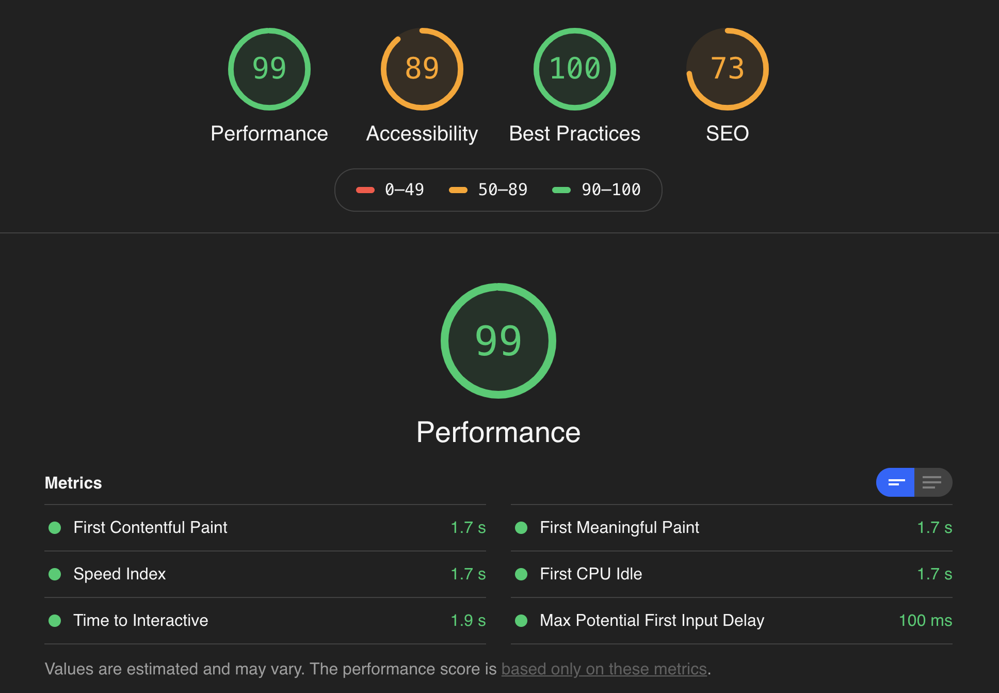

I just launched this new site using Gatsby. My portfolio was in need of a refresh as it still had projects from when I started using Javascript.


## Features

* Static Site Generator
* Server Side Rendering
* Built with React and Graph QL
* Easily deploy with Gatsby Cloud and Netlify
* High SEO rankings out of the box

Gatsby is a free and open source framework based on React that helps developers build blazing fast websites and apps. The coolest part about Gatsby to me is how fast you can go from starte files to deployed on a scalable CDN. I was able to deploy this site in these easy steps:

```
$ npm install -g gatsby-cli
$ gatsby new gatsby-site https://github.com/gatsbyjs/gatsby-starter-hello-world
$ cd gatsby-site
$ gatsby develop
```
From here I added plugins directly from gatsby to use graph QL and access markdown data. I set up a layout component and used SASS to set up styling modules. Next, I used Graph QL to query markdown post dynamically.

To read more about layout, check out the [Gatsby Page Layout Documentation](https://www.gatsbyjs.org/docs/recipes/pages-layouts/)

Here are all of the Gatsby plugins I used from [Gatsby Plugin Library](https://www.gatsbyjs.org/plugins/)

#### gatsby-config.js
```
module.exports = {
  siteMetadata: {
    title: 'Devin Bandara',
    author: 'Charutha Bandara',
    position: 'Software Engineer'
  },
  /* Your site config here */
  plugins: [
    'gatsby-plugin-sass',
    {
      resolve: 'gatsby-plugin-web-font-loader',
      options: {
        google: {
          families: ['Droid Sans', 'Raleway', 'Roboto']
        }
      }
    },
    {
      resolve: 'gatsby-source-filesystem',
      options: {
        name: 'src',
        path: `${__dirname}/src/`
      }
    },
    'gatsby-plugin-sharp',
    {
      resolve: 'gatsby-transformer-remark',
      options: {
        plugins: [
          'gatsby-remark-relative-images',
          {
            resolve: 'gatsby-remark-images',
            options: {
              maxWidth: 780,
              linkImagesToOriginal: false
            }
          }
        ]
      }
    }
  ]
}

```

#### gatsby-node.js
```
const path = require('path')

module.exports.onCreateNode = ({ node, actions }) => {
  const { createNodeField } = actions

  if (node.internal.type === 'MarkdownRemark') {
    const slug = path.basename(node.fileAbsolutePath, '.md')

    createNodeField({
      node,
      name: 'slug',
      value: slug
    })
  }
}

module.exports.createPages = async ({ graphql, actions }) => {
  const { createPage } = actions

  // Get path to template
  const blogTemplate = path.resolve('./src/templates/blog.js')

  // get markdown data
  const res = await graphql(`
    query {
    allMarkdownRemark {
      edges {
        node {
          fields{ slug }
          }
        }
      }
    }
`)

  res.data.allMarkdownRemark.edges.forEach((edge) => {
    createPage({
      component: blogTemplate,
      path: `/blog/${edge.node.fields.slug}`,
      context: {
        slug: edge.node.fields.slug
      }
    })
  })
}
```

After I set up my two files to accept staticQueries and read Markdown text, I loaded some of my siteMetadata into my index.js page

#### index.js
```
  const data = useStaticQuery(graphql`
  query {
    site {
      siteMetadata{
        position
      }
    }
  }`)
```

I then used graphQL to map over all my blog posts and display each post in a card element.

#### blog.js
```
const data = useStaticQuery(graphql`
    query {
      allMarkdownRemark {
        edges {
          node {
            id
            frontmatter {
              title
              date
              summary
            }
            html
            excerpt
            fields {
              slug
            }
          }
        }
      }
    }
  `)
```

I can then refer to this data like so:
#### blog.js
```
return (
    <Layout>
      <h1 className="main-title">Blog</h1>
      <ol className={blogStyles.blogList}>
        {data.allMarkdownRemark.edges.map((edge) => {
          return (
            <Link to={`/blog/${edge.node.fields.slug}`}>
              <li key={edge.node.id} className={blogStyles.blogCard}>
                <h2>{edge.node.frontmatter.title}</h2>
                <p>{edge.node.frontmatter.date}</p>
                <br />
                <p>{edge.node.frontmatter.summary}</p>
                <br />
                <div className={blogStyles.arrowLink} to="/contact" ></img></div>
              </li>
            </Link>
          )
        })}
      </ol>
    </Layout >
  )
```

Last step with Graph QL was to enable pagination and display individual blog posts with their own pages. I simply created a folder called templates and created a file called blog.js

#### ./templates/blog.js
```
import React from 'react';
import Layout from '../components/layout'
import { graphql } from 'gatsby'

export const query = graphql`
query($slug: String!) {
  markdownRemark(fields: {slug: { eq: $slug}}) {
    frontmatter {
      title
      date
    }
    html
  }
}
`

const Blog = (props) => {
  return (
    <Layout>
      <h1>{props.data.markdownRemark.frontmatter.title}</h1>
      <p>{props.data.markdownRemark.frontmatter.date}</p>
      <div dangerouslySetInnerHTML={{ __html: props.data.markdownRemark.html }}></div>
    </Layout>
  )
}

export default Blog
```

You can add whatever styles you need from here and you're good to go. Now lets deploy.

```
$ gatsby build
$ gatsby serve
```

In order to deploy my build I used Gatsby Cloud and Netlify. Gatsby cloud allows you to build a peview of your site as well as easily configure hosting to Netlify or add a headless CMS. To connect gatsby build, its as easy as adding your code to github and then selecting the github repo in Gatsby Cloud.



After you deploy your build you can see your Lighthouse performance score. From here you can grab a full report with recommendations on how to improve your site. 

Netlify was also a similar one click install from Gatsby Cloud.

Next is to customize the site SEO and connect the site to a headless CMS. Follow me on twitter for new posts 

Written By:
### Charutha Devin Bandara

#### @cbandara1010